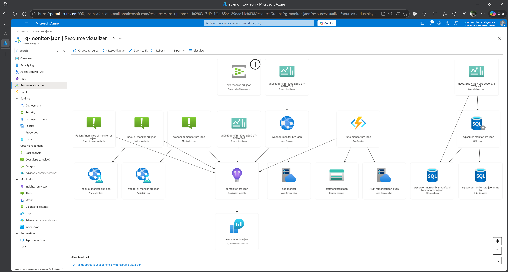

# 📘 Sessão 3 – Observabilidade de Aplicações com Application Insights

## 🎯 Objetivos da Sessão

* Compreender a monitorização de aplicações no Azure.
* Configurar Application Insights em App Services.
* Explorar métricas, logs e traces de aplicações.
* Analisar telemetria orientada à experiência do utilizador.





---

## ☁️ Monitorização de Aplicações no Azure

Aplicações modernas distribuídas exigem visibilidade sobre:

* Performance
* Erros
* Dependências
* Experiência do utilizador
* Fluxos entre serviços

A observabilidade de aplicações permite responder:

* A aplicação está lenta?
* Onde ocorre o erro?
* Qual serviço externo está a degradar?
* Qual endpoint é mais crítico?

---

## 🔎 O que é Application Insights?

O Application Insights é o serviço de observabilidade de aplicações do Azure Monitor.

Permite:

* Recolher telemetria automática de aplicações
* Medir performance e disponibilidade
* Detetar falhas e exceções
* Mapear dependências
* Analisar comportamento do utilizador

Na prática, fornece **APM (Application Performance Monitoring)** no Azure.

---

## 🧱 Arquitetura de Telemetria de Aplicações

Fluxo simplificado:

**Aplicação / SDK / Agent**
→ envia telemetria
→ **Application Insights**
→ dados em
**Log Analytics + Metrics**
→ visualização e análise

Tipos de recolha:

* Instrumentação automática
* SDK na aplicação
* OpenTelemetry

---

## 🌐 Monitorização de App Services

O Azure App Service integra nativamente com Application Insights.

Capacidades principais:

* Requests e tempo de resposta
* Falhas HTTP
* Exceções
* Dependências externas
* CPU e memória
* Logs de aplicação

Integração típica:

App Service → Application Insights → Log Analytics

---

## 📊 Métricas, Logs e Traces de Aplicações

### Métricas de Aplicação

Valores agregados:

* Requests/sec
* Failure rate
* Response time
* Availability

Usadas para:

* Dashboards
* Alertas
* SLO/SLA

---

### Logs de Aplicação

Eventos detalhados:

* Exceptions
* Traces
* Custom logs
* Requests

Consultáveis via KQL:

```kql
requests
| take 20
```

---

### Traces Distribuídos

Fluxo entre componentes:

* API → serviço → base de dados
* Microserviços
* Dependências externas

Permite:

* Identificar gargalos
* Latência por componente
* Cadeia de chamadas

---

## 👤 Telemetria e Experiência do Utilizador

Application Insights permite observar:

* Tempo de resposta percebido
* Erros por operação
* Endpoints mais usados
* Falhas por região
* Sessões de utilizador

Exemplos de perguntas:

* Qual página é mais lenta?
* Qual API falha mais?
* Qual cliente tem mais erros?
* A experiência degradou após deploy?

---

## 🧭 Principais Vistas do Application Insights

**Overview**
Saúde geral da aplicação

**Performance**
Tempo de resposta e operações

**Failures**
Erros e exceções

**Dependencies**
Serviços externos

**Application Map**
Topologia e latências

**Logs**
Consulta KQL

---

## 🧠 Boas Práticas de Observabilidade de Aplicações

* Instrumentar desde o início
* Correlacionar serviços via trace-id
* Monitorar dependências externas
* Definir SLOs de latência e erro
* Separar ambientes (prod/dev)
* Criar alertas orientados a utilizador

> 💡 Observabilidade de aplicações mede o impacto no utilizador, não apenas na infraestrutura.

---

## ✅ Conclusão da Sessão

Nesta sessão, entendemos:

* O papel do Application Insights na observabilidade de aplicações.
* A monitorização de App Services no Azure.
* As diferenças entre métricas, logs e traces de aplicações.
* Como a telemetria reflete a experiência do utilizador.

Na próxima sessão, vamos aprofundar a **criação de alertas inteligentes e análise com IA no Application Insights**.

---

> © MoOngy 2026 | Programa de formação em Observabilidade com Azure Monitor